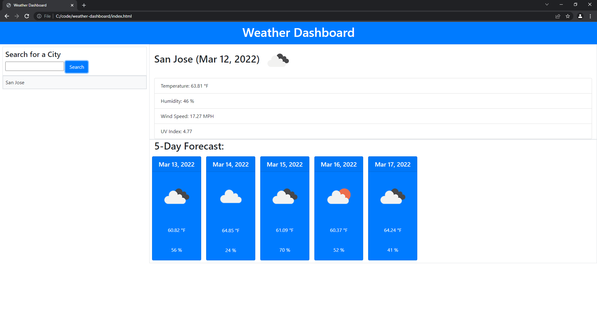

# Weather Dashboard

## Image of Application

## Description
This is a weather dashboard that will run in the browser and feature dynamically updated HTML and CSS.

## Utility
- searches city of choice
- displays weather, temperature, humidity, wind speed, UV index, time
- also displays same data as a weekly forecast
- uv index is colored
- previous searches are displayed

## Resources Used
- HTML
- CSS
- JavaScript
- moment.js
- Bootstrap
- Open weather API

### URL to Deployed Application: https://nitishd22.github.io/weather-dashboard/

Made by Nitish Doss
